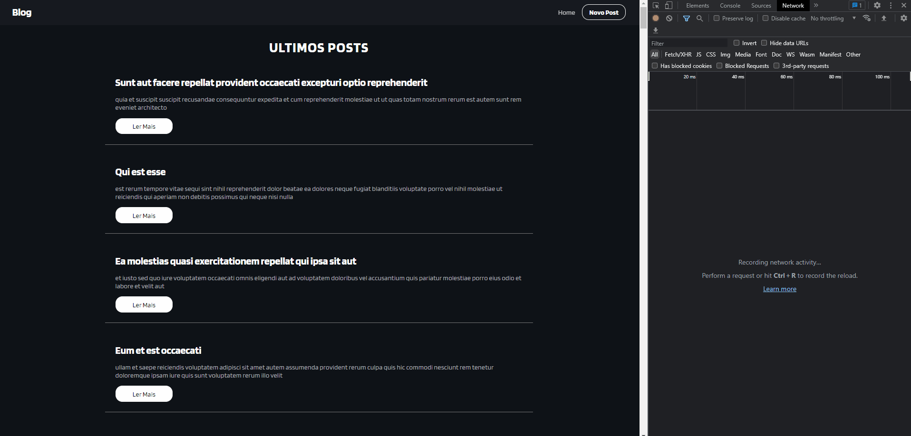

# ReactAxios
 
<h1 align="center"> React-Router + Axios  </h1>

<p align="center">
Aprendendo Router e Axios <br/>
</p>

<p align="center">
  <a href="#-tecnologias">Technologies</a>&nbsp;&nbsp;&nbsp;|&nbsp;&nbsp;&nbsp;
  <a href="#-projeto">Project</a>&nbsp;&nbsp;&nbsp; 

</p>

<br>

<p align="center">
  
</p>

## 🧭 Tech

Este projeto utilizei:

### Front-end
+ `ReactJS + TypeScript`
+ `React Router`
+ `Axiox`

### Client

  1º `$ cd react-axios`
  2º `$ yarn install`
  3º `$ yarn dev`

## 💻 Project

Aprendendo a utilizar Rotas com React Router, e consumindo API do site ```https://jsonplaceholder.typicode.com/``` Usando o Axios para consumir e enviar requição...


Made With 🧡 by Maykon!!! 